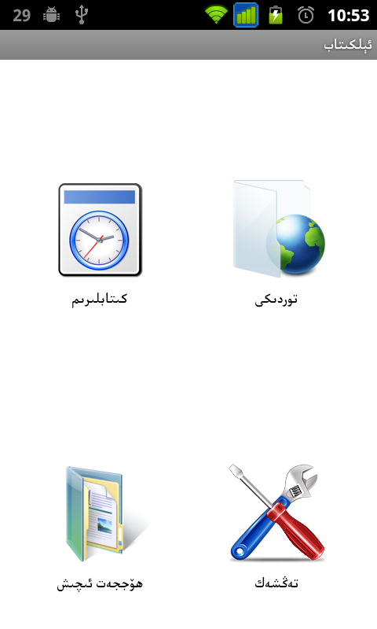
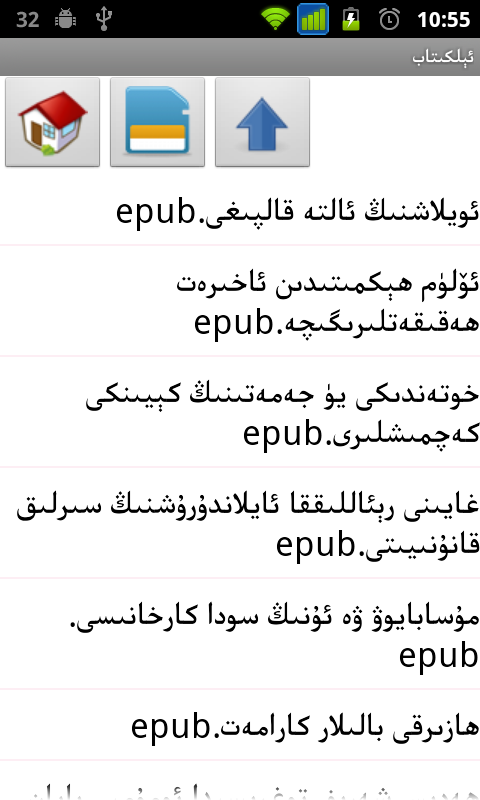
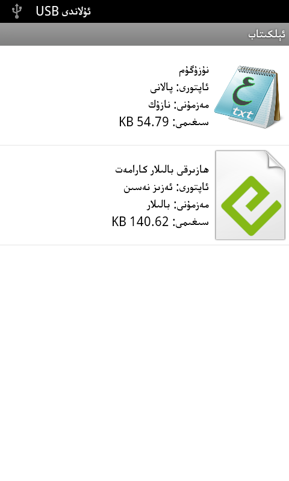
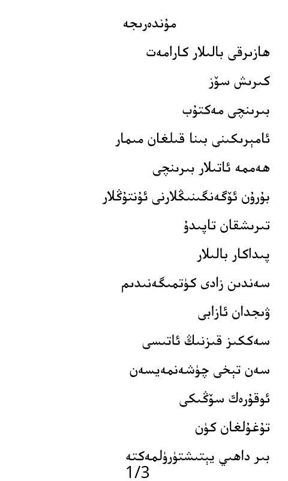

ePubReader
==========

Supported Uyghur Language ePub Reader for Android

بۇ پىروگرامما .epub فورماتىدىكى ئۇيغۇرچە ئېلېكترونلۇق كىتابلارنى ئوقۇش ئۈچۈن لايىھەلەنگەن. 
ئۈسكۈنىنىڭ ھەرقانداق ئورنىدىكى تېكىست ھۆججىتىنى تېپىپ ئاچقىلى بولىدۇ. مۇۋاپىق ئورۇندىن قۇرغا ئايرىيدۇ ۋە تەڭ ئۇزۇنلۇقتا تەكشىلەيدۇ. ھۆججەت تېكىستىنى ئىكران چوڭلۇقىغا ئاساسەن بەتكە بۆلۈپ چىقىرىپ بېرىدۇ. ئىكراننى بىسىپ بەتنى ئوڭ-سولغا يۆتكىگىلى ۋە بەت ئالماشتۇرغىلى بولىدۇ. باپلار تىزىملىكىدىن خالىغان باپنى تاللىغىلى بولىدۇ. ئاخىرقى كۆرۈلگەن بەت خەتكۈچتە ساقلىنىپ، كىتابنى قايتا ئاچقاندا يەنە شۇبەتنى ئېچىپ بېرىدۇ. خەت نۇسخىسى، خەت رەڭگى، خەت چوڭلۇقى، بەت چۆرىسى ۋە ئابزاس بۆلگۈچنى تەڭشىگىلى بولىدۇ. بەلگىلەنگەن تەڭشەك پىروگراممىنى تاقىغاندىمۇ ساقلىنىپ قالىدۇ

Screenshots
---------

Download Link:
* [Download from Google Play](https://play.google.com/store/apps/details?id=net.uyghurdev.uyghurepubreader.re)
* [Download from Bilkan Bazar](http://bazar.bilkan.net/App.aspx?id=170)
 
Other Links:
---------
* [ePub standarts](http://idpf.org/epub)
 

